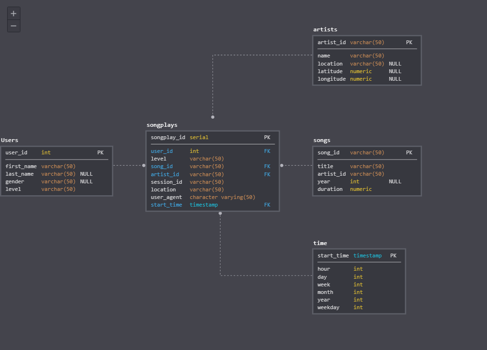

#Data Modeling - ETL process - SPARKIFY
========================================

The Datamart consists of 4 Dimensions and 1 Fact Table.




#### Project structure

*  /data  - Source of the JSON file, all these files have to be elaborated
  *  /log_data  - A folder that contains files of log files in JSON format generated by this [event simulator](https://github.com/Interana/eventsim) based on the songs in the dataset above. These simulate app activity logs from a music streaming app based on specified configurations.
  *  /song_data  -  Each file is in JSON format and contains metadata about a song and the artist of that song. The files are partitioned by the first three letters of each song's track ID
*  etl.ipynb  - It is a notebook that helps to know step by step what etl.py does
*  test.ipynb  - It is a notebook that helps to know if tables
   are created and data are ingested correctly 
*  create_tables.py  - This script will drop old tables (if exist) ad re-create new tables
*  etl.py  - This script will read JSON every file contained in /data folder, parse them,  build relations though logical process and ingest data 
*  sql_queries.py  - This file contains variables with SQL statement in String formats,  partitioned by CREATE, DROP, INSERT statements plus a FIND query 


#### Prequisites

* Postgresql
* Python


#### Step to Run

* Make sure Postges instance is running and corresponding user and roles are created.
 

* ```python3 create_tables.py``` 

* ```python3 etl.py``` 

